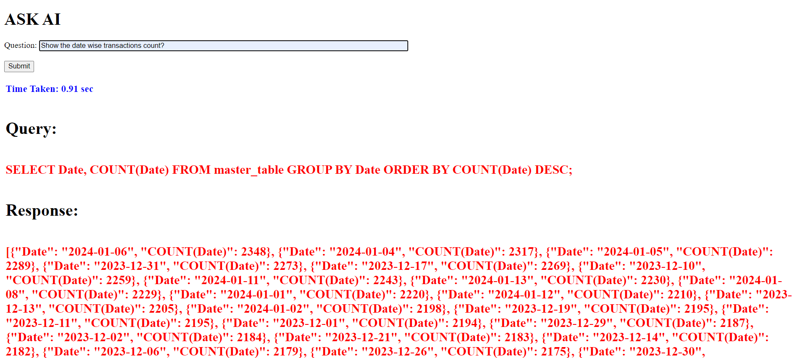

# Text_To_SQL
Convert the end user given Text to a SQL query

## Required softwares

Download Python and Anaconda softwares

## Available Scripts

In the project directory, you can run:

### `conda create -n test python==3.10.0`
To create a virtual environment with the python version 3.10.0.

### `pip install -r requirements.txt`
This will automaticaly install all the required packages

## To Train the Model
Check the `Train.py` file by updating the parameters and changing the dataset we can train a model.
I Have trained the model with my own dataset and generated the trained model and saved to local storage.

### `python app.py`
REST API will get started.
Below is the Screenshot of a demo API.

